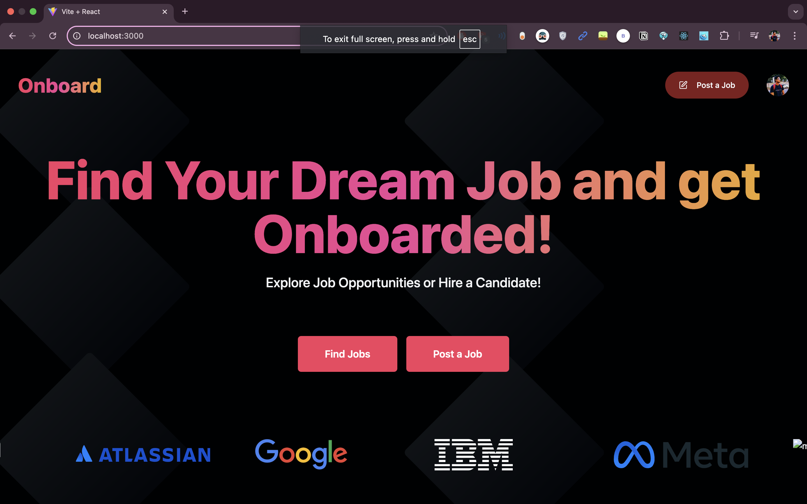
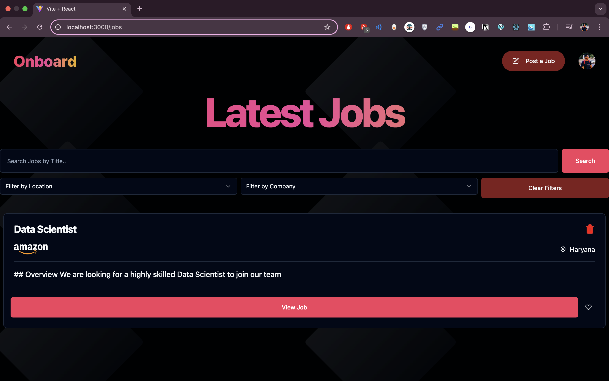
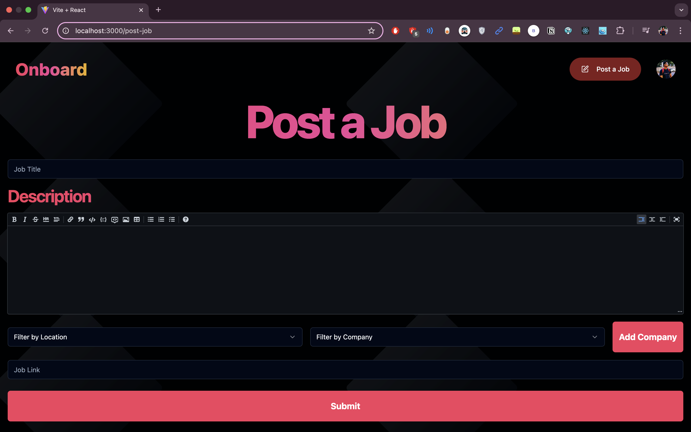

# Onboard - Job Management Application





Onboard is a React-based web application for managing job postings and applications. It offers users an intuitive interface to browse, save, post, and manage job opportunities effectively.

## Features

- **Job Listings**: View job postings with filtering options for search, location, and company.
- **Saved Jobs**: Save favorite job opportunities for future reference.
- **Post Jobs**: Allows companies to post new job opportunities with detailed information.
- **Company Management**: Add and manage companies via an interactive interface.
- **Responsive Design**: Ensures seamless usability across devices.

## Technologies Used

- **React**: Framework for building user interfaces.
- **React Router DOM**: For managing client-side routing.
- **Tailwind CSS**: For styling the UI components.
- **Supabase**: Backend for managing data storage and real-time updates.
- **Clerk**: For authentication and user management.
- **Custom Hooks**: Encapsulate reusable logic such as API calls.
- **BarLoader**: Visual feedback for loading states.

## Environment Variables

Make sure to create a `.env` file with the following variables:
```
VITE_SUPABASE_URL=
VITE_SUPABASE_ANON_KEY=
VITE_CLERK_PUBLISHABLE_KEY=
```
